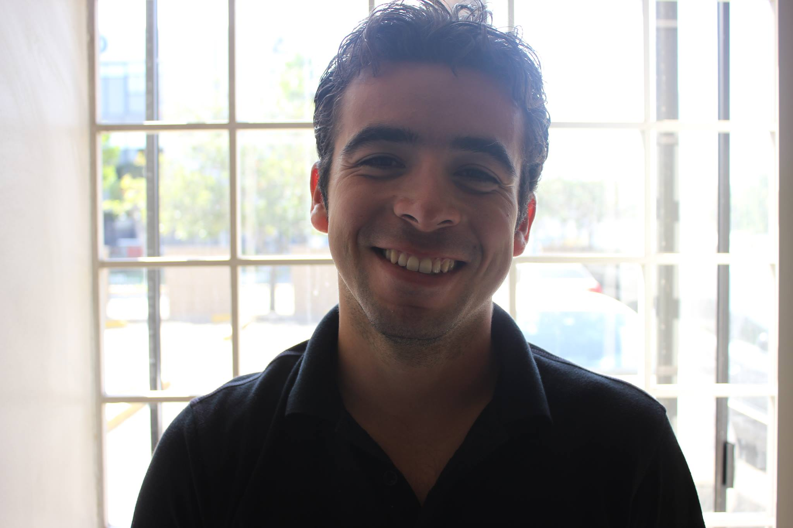

{:.avatar}

# Oscar Miranda 
Computer Science Student & Business Minded

<a href="mailto:">omiranda@softstackfactory.org</a>
|
<i class="fa fa-github"></i> <a href="https://github.com/omirandassf/omiranda.gitbhub.io.git">my account</a>
|
<i class="fa fa-twitter"></i> <a href="http://twitter.com/">mytwitteraccount</a>

## Currently

In a 12-week long immersion Dev- Bootcamp due to graduate in September of 2016.  
After graduating from my Masters I’ve taken up an interest in mobile technologies  
IOT and artificial intelligence. I would like to use my Finance skills and combine  
them with computer programming skills in order to become a more valuable employee.

## Education

`September-2016`
__SoftStack Factory - BootCamp__ 12-week long immersion Dev-bootcamp

`December-2015`
__Alliant International University__ Masters in Technology Management

`August-2013`
__San Diego State University__ Bachelors in Business Emphasis in Finance

## Technical skills

* HTML, CSS & Sass
* Javascript
* AngularJs
* MongoDB
* Express
* Node.Js
* Mean Stack
* Microsoft Word
* Microsoft Excel
* Microsoft Access
* Microsoft Powerpoint
* Microsoft Project
* SAP
* Tableau
* Google Analytics

## Projects
My very first Ionic Change Calculator

### CV

I created this web page to show off my CV.  

## Achievements

Coming Soon - Stay Tuned !

## Experience

`Jun-14-Aug-15`
__At&t__  
•	Developed and trained 15 new technicians to become a top 10 team in California. 
•	Generated over $10,000 in monthly revenue, creating new customers leads and maintaining old. 
•	Manage multiple building cabling projects simultaneously.  
•	Managed the workflow, communication & direction across multiple AT&T departments. 
•	Developed strategic sales plans to surpass monthly sales goals by $5,000 (100% above our goal). 
•	Participated in team-based planning processes.  
•	Led progress meetings with staff & team members to improve efficiency.  
•	Managed budgets and inventory. 
    o   Hold technicians accountable for not achieving productivity results and not being properly stocked everyday. 

`Jun-13-Dec-13`
__Aldi__  
•	Monitored and managed thousands in controllable store expenses. 
•	Managed a team of over 20 staff. 
•	Implemented and controlled store procedures.  
•	Organized staff training and development. 
•	Established, managed and reviewed the store grading systems to ensure optimum stock levels.  
•	Oversaw stock control and receiving orders. 
•	Analyzed sales figures and forecasted future sales volumes to maximize profits.  

`Jun-12-Jun-13`
__Miranda Satellite__  
•	Formulated policies and implemented procedures for growth initiatives. 
•	Grew new office 150% over a 12-month period, successfully generating above $100K in revenue. 
•	Managed budgeting process, profit and loss records for performing business and financial analysis and cost reports. 
•	Perform billing, payment allocation, collection and activity reporting following established protocols, to tight deadlines.  
•	Utilized strategic planning methodologies and goal setting to project financial and operations plans to work at the highest efficiency level. 
•	Responsible for demonstrating company products to existing and potential customers, attending marketing conferences, exhibitions, and seminars; making regular face to face and telephone contact with existing and potential customers.  
•	Maintained schedules for meetings with multiple business owners.  

`Feb-12-May-12`
__Arkan & Ergin__  
Performed customer segment research on Nano Tech companies and Investment patterns. 
• 	Developed understanding of customer markets and segments. 
•	Created PowerPoint presentations for executives.
•	Crafted a Nano tech seed fund and thousands in new business leads. 
•	Worked with one their client and a financial analyst, on the clients expense tracking, financial statement analysis and on creating a forecasting model, based on historical data. 

## Hobbies

* Excercising
* Swimming
* Travel
* Learning new stuff - Languages
* Play with new tech toys!

## Links

* <i class="fa fa-envelope"></i> <a href="mailto:">omiranda@softstackfactory.org</a> 
* <i class="fa fa-github"></i> <a href="http://github.com/">my account</a> 
* <i class="fa fa-twitter"></i> <a href="http://twitter.com/">mytwitteraccount</a> 
* <i class="fa fa-stack-overflow"></i> <a href="http://stackoverflow.com/">SO Account</a>
* <i class="fa fa-google"></i> <a href="http://scholar.google.com/">scholar</a>
